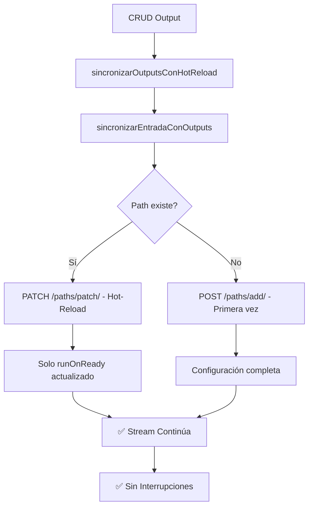

# Hot-Reload de Outputs sin Interrupciones

## Problema Resuelto

Anteriormente, cuando se modificaba o agregaba un output personalizado, el sistema usaba `POST /replace` que **reemplazaba completamente la configuración del path** en MediaMTX, causando una **interrupción temporal del stream**.

## Solución Implementada

### 1. Nuevo Método PATCH para Hot-Reload

Se implementó un método `actualizarPath()` que usa **PATCH** en lugar de **POST /replace**:

```typescript
private async actualizarPath(nombre: string, configuracionParcial: any): Promise<void> {
  await this.httpService.axiosRef.patch(
    `${this.baseUrl}/v3/config/paths/patch/${encodeURIComponent(nombre)}`,
    configuracionParcial,
  );
}
```

### 2. Lógica Inteligente de Sincronización

El método `sincronizarEntradaConOutputs()` ahora:

- **Path existe**: Usa **PATCH** para actualizar solo `runOnReady` → **SIN INTERRUPCIONES**
- **Path no existe**: Usa **POST** para crear configuración completa → **Primera vez**

```typescript
if (await this.pathConfigExiste(pathName)) {
  // Hot-reload: solo actualiza runOnReady
  const configuracionRunOnReady = this.generarConfiguracionRunOnReady(entrada, outputs);
  await this.actualizarPath(pathName, configuracionRunOnReady);
} else {
  // Primera vez: configuración completa
  const pathConfig = this.generarConfiguracionPathCompleta(entrada, outputs);
  await this.agregarPath(pathName, pathConfig);
}
```

### 3. Métodos CRUD Optimizados

Los métodos CRUD ahora usan `sincronizarOutputsConHotReload()` específicamente para hot-reload:

```typescript
// ✅ ANTES (causaba interrupciones)
await this.sincronizarEntradaCompleta(entradaId);

// ✅ AHORA (hot-reload sin interrupciones)
await this.sincronizarOutputsConHotReload(entradaId);
```

**Métodos afectados:**
- `crearSalida()` - Agregar output sin interrumpir
- `actualizarSalida()` - Modificar output sin interrumpir  
- `eliminarSalida()` - Quitar output sin interrumpir

### 4. Nuevo Endpoint para Hot-Reload Manual

```http
PATCH /streams/entradas/{id}/outputs/hot-reload
```

Permite forzar la sincronización con hot-reload para casos específicos.

## Beneficios

✅ **Sin interrupciones**: Los streams continúan fluyendo durante modificaciones de outputs
✅ **Hot-reload real**: Solo se actualiza la configuración de `runOnReady`
✅ **Compatibilidad**: Funciona con streams RTMP, SRT y HLS activos
✅ **Logs claros**: Diferencia entre hot-reload y reemplazo completo
✅ **CRUD optimizado**: Crear, actualizar y eliminar outputs sin parar streams

## Casos de Uso

### Agregar Output a Stream Activo ✅
```bash
# El stream sigue funcionando mientras se agrega el nuevo output
POST /streams/salidas
{
  "entradaId": "entrada-123",
  "protocolo": "RTMP",
  "urlDestino": "rtmp://youtube.com/live2/NUEVA_CLAVE"
}
```

### Modificar Output Existente ✅
```bash
# El stream no se interrumpe al cambiar la URL de destino
PUT /streams/salidas/salida-456
{
  "urlDestino": "rtmp://twitch.tv/live/NUEVA_CLAVE_TWITCH"
}
```

### Eliminar Output ✅
```bash
# El stream continúa, solo se elimina un output
DELETE /streams/salidas/salida-789
```

### Sincronización Manual
```bash
# Fuerza hot-reload sin interrumpir
PATCH /streams/entradas/entrada-123/outputs/hot-reload
```

## Logs de Ejemplo

### Hot-Reload de CRUD (Sin Interrupción)
```
[StreamsService] Hot-reload de outputs para entrada 'Mi Stream' (2 outputs)
[MediaMTXService] Path 'live/abc123' ya existe. Actualizando solo runOnReady para evitar interrupciones.
[MediaMTXService] Path 'live/abc123' actualizado exitosamente con hot-reload (sin interrupción).
[StreamsService] Sincronización completada para 'Mi Stream' sin interrumpir el stream.
```

### Primera Configuración (Solo en Creación)
```
[MediaMTXService] Path 'live/abc123' no existe. Creando nueva configuración completa.
[MediaMTXService] Path 'live/abc123' agregado exitosamente a MediaMTX.
```

## Arquitectura Técnica



## Flujo Completo

1. **Usuario modifica output** en frontend
2. **API CRUD** (POST/PUT/DELETE) procesa cambio
3. **Base de datos** se actualiza
4. **`sincronizarOutputsConHotReload()`** se ejecuta
5. **MediaMTX recibe PATCH** con nueva configuración `runOnReady`
6. **Stream continúa** sin interrupciones
7. **Nuevo output** se activa/desactiva/modifica inmediatamente

## Compatibilidad

- **MediaMTX**: v1.9.0+ (requiere soporte para PATCH)
- **Protocolos**: RTMP, SRT, HLS
- **FFmpeg**: Requerido para comandos `runOnReady`
- **Operaciones**: CREATE, UPDATE, DELETE outputs sin interrupciones